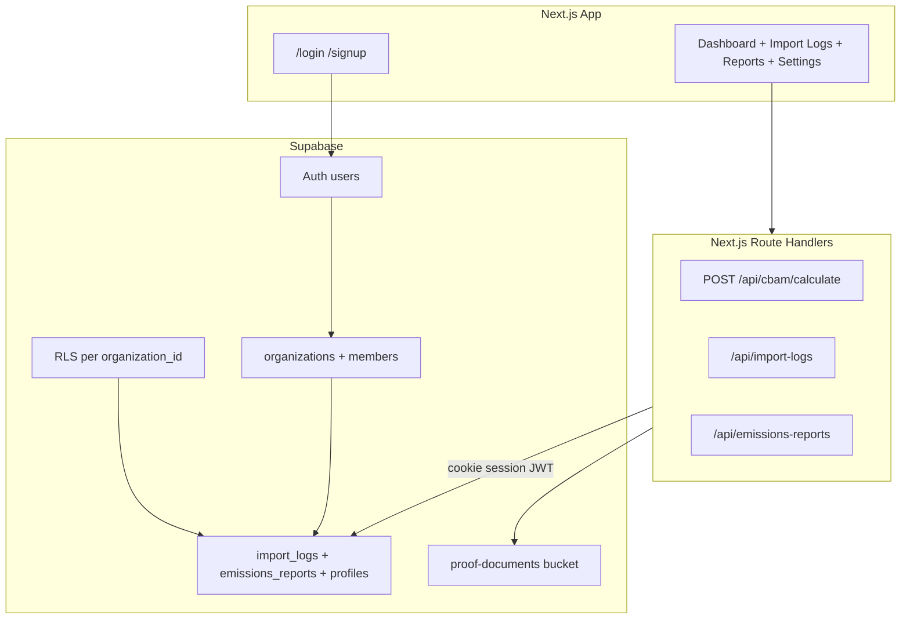

# CBAMVault 7-Day Deployable MVP Plan

## Current State vs Day-7 Target

**What already works** (keep and wire up):
- Importer UI: import form, CRUD table, dashboard stats ([`src/components/imports/`](src/components/imports/))
- CBAM calculation engine ([`src/lib/cbam-calculator.ts`](src/lib/cbam-calculator.ts), [`src/app/api/cbam/calculate/route.ts`](src/app/api/cbam/calculate/route.ts))
- Quarterly report aggregation + XML export ([`src/lib/report-compliance.ts`](src/lib/report-compliance.ts), [`src/lib/report-export.ts`](src/lib/report-export.ts))
- Settings UI with profile/org fields ([`src/components/settings/`](src/components/settings/))

**Critical gaps blocking production**:
- No auth (open dashboard, `user_key = 'default'`, public RLS in [`supabase/schema.sql`](supabase/schema.sql))
- Dual persistence: APIs fall back to in-memory stores when Supabase is unset ([`src/app/api/import-logs/route.ts`](src/app/api/import-logs/route.ts))
- Proof files stored as browser blob URLs only (filename persisted, file lost on refresh)
- Hardcoded demo content on dashboard ([`src/app/(dashboard)/page.tsx`](src/app/(dashboard)/page.tsx))
- No migrations, no tenant isolation, service role used server-side bypassing RLS ([`src/lib/supabase/server.ts`](src/lib/supabase/server.ts))

**Explicitly out of scope for 7 days** (document as Phase 2):
- Collaborative bridge / shared `shipment` models
- Exporter/supplier passwordless portal
- Stripe billing and premium gating
- FastAPI backend (stay Next.js Route Handlers — fastest path, calculation engine already in TypeScript)
- EU registry XML submission (export-only is sufficient for MVP)

---

## Recommended Architecture (Day 7)



**Backend decision:** Keep **Next.js + Supabase only**. The calculation engine is already in TypeScript; splitting to FastAPI would cost 2+ days with no MVP benefit. Revisit FastAPI only if you later need heavy async batch jobs or non-JS integrations.

**Tenant model (minimal, not full workspace SaaS):**
- On signup: create `organizations` row + `organization_members` row (role: `owner`)
- All `import_logs` and `emissions_reports` get `organization_id`
- `profiles` keyed by `user_id` (FK to `auth.users`) instead of `user_key = 'default'`
- One org per user for MVP; team invites deferred

---

## Day-by-Day Sprint

### Day 1 — Supabase foundation and schema migration

**Goal:** Production database with tenant columns and proper migration history.

1. Initialize Supabase CLI locally (`supabase init`) and create first migration from evolved schema.
2. Add tables/columns:

```sql
-- New
organizations (id, name, eori_number, vat_tax_id, created_at)
organization_members (organization_id, user_id, role)

-- Alter existing
import_logs.organization_id uuid not null references organizations
emissions_reports.organization_id uuid not null references organizations
profiles: replace user_key with user_id uuid references auth.users unique
```

3. Add indexes on `(organization_id, created_at desc)` for both data tables.
4. Create Supabase Storage bucket `proof-documents` (private).
5. Add database trigger or signup hook pattern: **on first login**, ensure org + membership + profile exist (use Supabase Auth trigger or app-side bootstrap in middleware).
6. Update [`src/types/database.ts`](src/types/database.ts) to match new schema.
7. Configure Vercel + local env from [`.env.local.example`](.env.local.example) — **remove service role from routine API paths** (keep only if needed for admin scripts).

**Exit criteria:** Migration applies cleanly; advisors show no critical RLS/security issues.

---

### Day 2 — Auth and route protection

**Goal:** Unauthenticated users cannot access the dashboard.

1. Add `@supabase/ssr` package; replace raw `@supabase/supabase-js` browser/server clients with SSR cookie pattern per Supabase Next.js App Router docs.
2. Create auth routes:
   - [`src/app/(auth)/login/page.tsx`](src/app/(auth)/login/page.tsx) — email + password (magic link optional stretch)
   - [`src/app/(auth)/signup/page.tsx`](src/app/(auth)/signup/page.tsx) — creates auth user + org bootstrap
3. Add [`src/middleware.ts`](src/middleware.ts) to protect `(dashboard)` routes and redirect unauthenticated users to `/login`.
4. Wire header user menu ([`src/components/layout/header.tsx`](src/components/layout/header.tsx)): show email, logout action.
5. Remove `DEFAULT_USER_KEY = 'default'` pattern from [`src/lib/settings-schema.ts`](src/lib/settings-schema.ts) and [`src/lib/supabase-client.ts`](src/lib/supabase-client.ts).

**Exit criteria:** Sign up → land on dashboard; logout → blocked from dashboard; session persists across refresh.

---

### Day 3 — Secure RLS and API tenant scoping

**Goal:** Users only read/write their organization's data; no public policies.

Replace open policies in [`supabase/schema.sql`](supabase/schema.sql) with:

```sql
-- Example pattern
create policy "members read import_logs"
  on import_logs for select
  using (organization_id in (
    select organization_id from organization_members
    where user_id = auth.uid()
  ));
```

Apply same pattern for insert/update/delete on `import_logs`, `emports_reports`, `profiles`, and storage objects.

Refactor API routes to use **user-scoped Supabase client** (cookie session), not service role:
- [`src/app/api/import-logs/route.ts`](src/app/api/import-logs/route.ts) and [`[id]/route.ts`](src/app/api/import-logs/[id]/route.ts)
- [`src/app/api/emissions-reports/route.ts`](src/app/api/emissions-reports/route.ts)
- Inject `organization_id` server-side from membership lookup — never trust client-supplied org ID.

**Remove or gate in-memory fallback** for production: if Supabase env vars missing, show configuration error instead of silent demo mode.

**Exit criteria:** Two test users cannot see each other's imports; direct Supabase REST calls with anon key respect RLS.

---

### Day 4 — Proof document storage and settings persistence

**Goal:** Foreign carbon price proof files survive refresh and are org-scoped.

1. Upload proof files to `proof-documents/{organization_id}/{import_id}/{filename}` via signed upload or server proxy route.
2. Store `proof_of_payment_storage_path` (new column) alongside existing filename in `import_logs`.
3. Add download/view link in import table for authorized org members only.
4. Connect settings forms to authenticated `profiles` row keyed by `user_id`; org fields (EORI, VAT) live on `organizations` table and populate XML export metadata.

**Exit criteria:** Upload proof → refresh page → file still accessible; settings persist per user/org.

---

### Day 5 — Reports hardening and compliance dashboard

**Goal:** End-to-end importer workflow is trustworthy for a pilot customer.

1. **Reports:** Ensure report creation pulls only current org's imports; add PATCH endpoint for status transitions (`draft` → `submitted` at minimum).
2. **XML export:** Inject org EORI/VAT from database into [`generateReportXml()`](src/lib/report-export.ts) instead of hardcoded placeholders; add basic schema sanity checks (required fields, numeric formats).
3. **Dashboard compliance summary:** Replace hardcoded values in [`src/app/(dashboard)/page.tsx`](src/app/(dashboard)/page.tsx) with computed metrics from imports/reports (current quarter liability, import count, next deadline).
4. **ETS price:** Keep env override `CBAM_ETS_PRICE`; optionally add cached fetch in [`src/lib/ets-price.ts`](src/lib/ets-price.ts) with fallback — do not block MVP on live feed.
5. **PDF:** Either generate a minimal real PDF (e.g. `@react-pdf/renderer`) or hide PDF button and ship XML-only with clear labeling — avoid shipping mock `.pdf` text files.

**Exit criteria:** User can complete full flow: signup → log imports → generate Q1 report → download valid XML with their EORI.

---

### Day 6 — UI polish, error handling, and QA

**Goal:** Production-ready UX, no demo leaks.

1. Remove "In-memory demo" / "Phase 2" copy from UI ([`emissions-reports-page-content.tsx`](src/components/emissions/emissions-reports-page-content.tsx), dashboard).
2. Add loading/error/empty states on all data-fetching pages.
3. Add toast feedback for CRUD operations (Sonner already installed).
4. Run through CBAM calculation edge cases: zero mass rejection, foreign price deduction, default emission factor flagging in reports.
5. Add smoke test script or manual QA checklist (see below).
6. `npm run build` must pass with no TypeScript errors.

**Exit criteria:** Clean build; no demo strings; consistent error messages.

---

### Day 7 — Deploy, monitor, and pilot readiness

**Goal:** Live URL a mid-market importer can use.

1. Deploy to Vercel (project already linked in [`.vercel/`](.vercel/)).
2. Set production env vars: `NEXT_PUBLIC_SUPABASE_URL`, `NEXT_PUBLIC_SUPABASE_ANON_KEY`, `CBAM_ETS_PRICE` (no service role in Vercel unless strictly needed server-side).
3. Run Supabase migration against production project.
4. Smoke test on production URL with fresh signup.
5. Write short **Pilot Runbook** (1 page): signup steps, how to log an import, how to export XML, known limitations (no supplier bridge yet).
6. Tag release `v0.1.0-mvp`.

**Exit criteria:** Production signup-to-XML flow works; RLS verified on prod.

---

## Key Files to Change

| Area | Primary files |
|------|---------------|
| Schema / RLS | [`supabase/schema.sql`](supabase/schema.sql) → new `supabase/migrations/` |
| Auth SSR | New `middleware.ts`, `src/lib/supabase/server.ts`, `src/lib/supabase/client.ts` |
| Auth UI | New `(auth)/login`, `(auth)/signup` pages |
| API scoping | [`src/app/api/import-logs/*`](src/app/api/import-logs/), [`src/app/api/emissions-reports/route.ts`](src/app/api/emissions-reports/route.ts) |
| Settings | [`src/lib/supabase-client.ts`](src/lib/supabase-client.ts), settings forms |
| Storage | New `src/app/api/proof-upload/route.ts` (or similar) |
| Dashboard | [`src/app/(dashboard)/page.tsx`](src/app/(dashboard)/page.tsx), [`stat-cards.tsx`](src/components/dashboard/stat-cards.tsx) |
| Types | [`src/types/database.ts`](src/types/database.ts) |

---

## Manual QA Checklist (run Day 6 and Day 7)

- [ ] Sign up new user → org + profile created
- [ ] Log Steel import (1000 kg, CN mapped) → liability calculated
- [ ] Edit and delete import
- [ ] Upload foreign carbon proof → persists after refresh
- [ ] Create Q1 2026 report from selected imports → aggregated rows correct
- [ ] Export XML → contains org EORI, correct totals
- [ ] Second user cannot see first user's data
- [ ] Logout blocks dashboard access

---

## Risks and Mitigations

| Risk | Mitigation |
|------|------------|
| Auth + RLS takes longer than 2 days | Use single-org-per-user model; defer team invites |
| Service role bypass hides RLS bugs | Switch APIs to cookie client early on Day 3 |
| XML not matching official EU XSD | MVP = structured export with org metadata; validate against XSD in Phase 2 |
| Scope creep toward bridge/Stripe | Lock backlog; bridge starts only after MVP pilot feedback |

---

## Post-MVP Roadmap (after Day 7)

1. **Phase 2 — Bridge:** Introduce `shipments` table linking importer org + supplier invite token; exporter submission updates shared emission data.
2. **Phase 3 — Monetization:** Stripe Checkout + `subscriptions` table gating report export volume or supplier seats.
3. **Phase 4 — Integrations:** Customs declaration ingest (MRN/BOL), optional FastAPI worker for batch recalculation.
