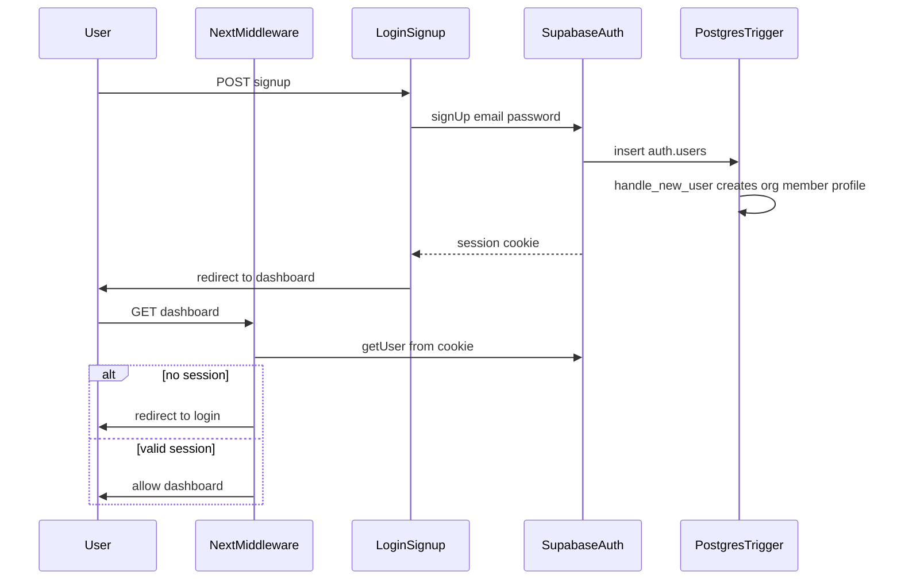

# Day 2 — Auth and Route Protection

## Goal

Unauthenticated users cannot access the dashboard. A new user can sign up, get an organization workspace automatically, land on the dashboard, stay signed in across refresh, and sign out cleanly.

**Exit criteria (from master plan):**
- Sign up → land on dashboard
- Logout → blocked from dashboard
- Session persists across refresh
- Org + profile rows created on first signup (via Day 1 trigger)

---

## Dependency: Day 1 must be done first

Day 2 org bootstrap relies on the Day 1 migration trigger in [`supabase/migrations/20260625000000_mvp_schema.sql`](supabase/migrations/20260625000000_mvp_schema.sql):

```sql
-- on auth.users insert → organizations + organization_members + profiles
create trigger on_auth_user_created
  after insert on auth.users
  for each row execute function public.handle_new_user();
```

**Before starting Day 2 work:** confirm the migration has been run in your Supabase project (SQL Editor or CLI). Without it, signup creates an auth user but no org/profile, and settings/API calls will fail.

---

## Current codebase status

Most Day 2 code is **already implemented** from the prior sprint. Day 2 work is primarily **configure Supabase → verify flows → fix gaps**.

| Task | Status | Key file(s) |
|------|--------|-------------|
| `@supabase/ssr` installed | Done | [`package.json`](package.json) |
| Browser + server SSR clients | Done | [`src/lib/supabase/client.ts`](src/lib/supabase/client.ts), [`src/lib/supabase/server.ts`](src/lib/supabase/server.ts) |
| Middleware session refresh + route guard | Done | [`src/middleware.ts`](src/middleware.ts), [`src/lib/supabase/middleware.ts`](src/lib/supabase/middleware.ts) |
| Login / signup pages | Done | [`src/app/(auth)/login/page.tsx`](src/app/(auth)/login/page.tsx), [`src/app/(auth)/signup/page.tsx`](src/app/(auth)/signup/page.tsx) |
| Shared auth form (email + password) | Done | [`src/components/auth/auth-form.tsx`](src/components/auth/auth-form.tsx) |
| Header user menu + logout | Done | [`src/components/layout/user-menu.tsx`](src/components/layout/user-menu.tsx) |
| Remove `DEFAULT_USER_KEY` / `user_key` | Done | No matches in `src/`; settings use `userId` + `organizationId` in [`src/lib/settings-schema.ts`](src/lib/settings-schema.ts) |
| Org bootstrap on signup | Done (DB trigger) | Migration `handle_new_user()` |

---

## Auth flow (target architecture)



**Protected routes** (already configured in [`src/lib/supabase/middleware.ts`](src/lib/supabase/middleware.ts)):
- `/`, `/import-logs/*`, `/emissions-reports/*`, `/settings/*`
- API: `/api/import-logs`, `/api/emissions-reports`, `/api/proof*` (401 JSON if unauthenticated)
- **Public:** `/login`, `/signup`, `/api/cbam/calculate`

---

## Step-by-step work plan

### Step 1 — Local environment

1. Ensure [`.env.local`](.env.local) exists (copy from [`.env.local.example`](.env.local.example)) with real values:
   - `NEXT_PUBLIC_SUPABASE_URL`
   - `NEXT_PUBLIC_SUPABASE_ANON_KEY`
2. Run `npm run dev` and confirm no Supabase configuration errors on auth pages.

### Step 2 — Supabase Auth dashboard configuration

In Supabase → **Authentication → Providers → Email**:

1. Enable **Email** provider.
2. For MVP pilot/dev, **disable "Confirm email"** so signup immediately returns a session and satisfies the exit criteria. If you keep confirmation enabled, you must add a "check your email" UI in [`auth-form.tsx`](src/components/auth/auth-form.tsx) instead of redirecting to dashboard.
3. Set **Site URL** to `http://localhost:3000` (local) and your Vercel URL (production).
4. Add redirect URLs: `http://localhost:3000/**` and `https://your-app.vercel.app/**`.

### Step 3 — Verify SSR client wiring (no code changes expected)

Confirm these patterns are used everywhere (already in place):

- **Client components:** `createBrowserClient()` from [`src/lib/supabase/client.ts`](src/lib/supabase/client.ts)
- **Server components / API routes:** `createClient()` from [`src/lib/supabase/server.ts`](src/lib/supabase/server.ts)
- **Middleware:** `createServerClient` with cookie get/set in [`src/lib/supabase/middleware.ts`](src/lib/supabase/middleware.ts)

Do **not** reintroduce service-role client or raw `@supabase/supabase-js` `createClient` for routine auth — that bypasses RLS (Day 3 concern, but avoid regressions now).

### Step 4 — Verify auth UI and session UX

Walk through locally:

1. Visit `/` while logged out → redirected to `/login?redirect=/`.
2. **Sign up** with email + password (min 8 chars) + optional full name.
3. Confirm redirect to dashboard and header shows name/email from profile.
4. **Refresh** page → still authenticated.
5. **Logout** via header → redirected to `/login`; visiting `/` blocked again.
6. **Sign in** with same credentials → dashboard accessible.

In Supabase **Table Editor**, after signup verify rows exist in:
- `auth.users`
- `organizations` (empty name is OK initially)
- `organization_members` (role `owner`)
- `profiles` (email + compliance_officer_name from signup metadata)

### Step 5 — Close known gaps (implement if verification fails)

These are the only code changes likely needed:

**A. Email confirmation handling** ([`src/components/auth/auth-form.tsx`](src/components/auth/auth-form.tsx))

If Supabase email confirmation stays enabled, update signup success path:
- Check `data.session` from `signUp` response
- If no session, show "Check your email to confirm" instead of `router.push(redirect)`

**B. Preserve redirect on auth page links**

Login page sets `?redirect=` but the signup link in auth-form is hardcoded to `/signup` without the param. Update the Link to pass through `redirect` search param so post-signup lands on the intended page.

**C. Middleware bypass when env vars missing** ([`src/lib/supabase/middleware.ts`](src/lib/supabase/middleware.ts) lines 7–12)

Currently, if Supabase env vars are unset, middleware skips auth entirely. For Day 2 hardening, redirect to a configuration error page or block protected routes when `!isSupabaseConfigured()` instead of allowing open access.

**D. Settings load errors after signup**

If [`fetchUserSettings`](src/lib/supabase-client.ts) throws "Organization not found" immediately after signup, the trigger may not have run (Day 1 migration missing) or RLS is blocking reads — verify migration and that the user has a row in `organization_members`.

### Step 6 — Manual QA checklist (Day 2 sign-off)

Run before marking Day 2 complete:

- [ ] Unauthenticated `/` → `/login`
- [ ] Unauthenticated `/settings` → `/login`
- [ ] Unauthenticated `GET /api/import-logs` → 401 JSON
- [ ] Signup creates org + profile in Supabase
- [ ] Signup → dashboard with session
- [ ] Refresh keeps session
- [ ] Logout blocks dashboard
- [ ] Authenticated user visiting `/login` → redirected to `/`
- [ ] `npm run build` passes

---

## Files touched (if gaps need fixing)

| Change | File |
|--------|------|
| Email confirm UX | [`src/components/auth/auth-form.tsx`](src/components/auth/auth-form.tsx) |
| Redirect param on signup link | [`src/components/auth/auth-form.tsx`](src/components/auth/auth-form.tsx) |
| Block routes when env missing | [`src/lib/supabase/middleware.ts`](src/lib/supabase/middleware.ts) |

No new files required unless email-confirm UX warrants a dedicated `/auth/confirm` page (stretch goal, not MVP).

---

## Out of scope for Day 2 (defer)

- Magic link / OAuth providers
- Password reset flow
- Team invites / multi-org switching
- API tenant scoping and RLS hardening → **Day 3**
- Service role removal from any remaining admin paths → **Day 3**

---

## Handoff to Day 3

Once Day 2 exit criteria pass, Day 3 replaces open/public RLS with org-scoped policies and refactors API routes to use [`getApiContext()`](src/lib/auth/api-context.ts) with the cookie-scoped client — ensuring two users cannot see each other's data.
