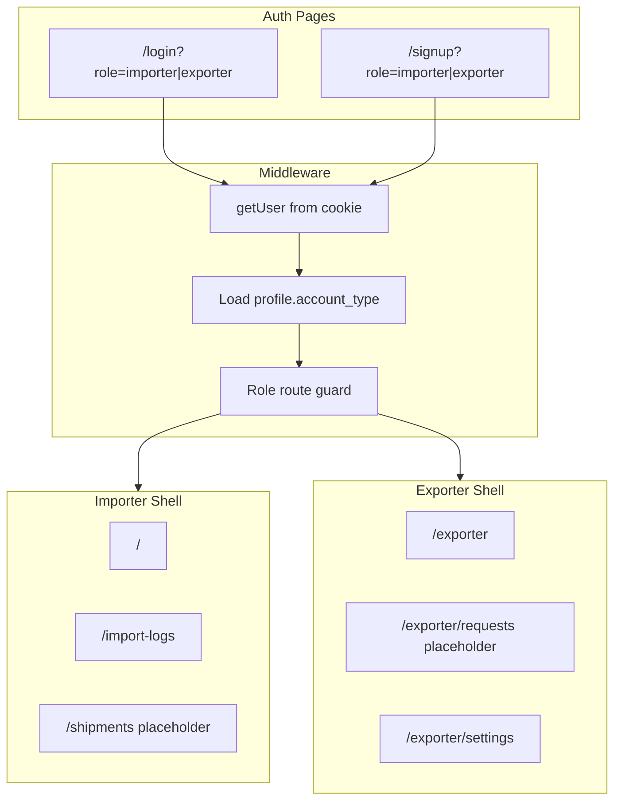

# Day 4 — Dual Auth UI + Role-Based Routing

## Goal

Users choose **Importer** or **Exporter** at sign-in/sign-up. Each lands on the correct dashboard. Cross-role URL access is blocked. No shipment/invite functionality yet (Day 5).

**Exit criteria:**
- Importer signup/login → `/` (existing dashboard)
- Exporter signup/login → `/exporter`
- Exporter visiting `/import-logs` → redirected to `/exporter`
- Importer visiting `/exporter` → redirected to `/`
- Login with wrong role selected → clear error toast
- `npm run build` passes

---

## Current state (Day 3 done)

| Area | Status |
|------|--------|
| `organizations.org_type`, `profiles.account_type` | In DB |
| [`getApiContext()`](src/lib/auth/api-context.ts) returns `accountType`, `orgType` | Done |
| [`requireImporterContext()`](src/lib/auth/api-context.ts) / `requireExporterContext()` | Done |
| Auth form | Single role — no toggle, no `account_type` on signup |
| Routes | Only [`(dashboard)`](src/app/(dashboard)/) — no exporter pages |
| Middleware | Auth guard only — no role routing |

---

## Architecture



**URL strategy:** Keep importer URLs unchanged (`/`, `/import-logs`, etc.) to avoid breaking existing links. Add exporter under `/exporter/*`. No folder rename required — `(dashboard)` stays as the importer route group.

---

## Step 1 — Auth form: role toggle + metadata

**File:** [`src/components/auth/auth-form.tsx`](src/components/auth/auth-form.tsx)

1. Add state `accountType: 'importer' | 'exporter'`, initialized from `searchParams.get('role')` (default `importer`).
2. Add UI toggle (tabs or segmented control) above the form:
   - **Sign in as Importer** | **Sign in as Exporter**
   - Copy adjusts per role (importer: compliance dashboard; exporter: emission submissions portal).
3. **Signup:** pass metadata in `signUp`:
   ```ts
   options: { data: { full_name, account_type: accountType } }
   ```
   DB trigger [`handle_new_user()`](supabase/migrations/20260626000001_fix_storage_rls.sql) already reads this.
4. **Login:** after `signInWithPassword`, fetch profile:
   ```ts
   supabase.from('profiles').select('account_type').eq('user_id', user.id).single()
   ```
   If `account_type !== selectedRole` → sign out, toast error ("This account is registered as an exporter/importer").
5. **Post-auth redirect:**
   - Importer → `redirect` param or `/`
   - Exporter → `/exporter` (ignore importer redirect paths)
6. Preserve `role` in login/signup toggle links alongside existing `redirect` param.

**Files:** [`src/app/(auth)/login/page.tsx`](src/app/(auth)/login/page.tsx), [`signup/page.tsx`](src/app/(auth)/signup/page.tsx) — no structural change needed; optional metadata title tweak.

---

## Step 2 — Middleware role routing

**File:** [`src/lib/supabase/middleware.ts`](src/lib/supabase/middleware.ts)

After `getUser()`, if authenticated, load role once per request:

```ts
const { data: profile } = await supabase
  .from('profiles')
  .select('account_type')
  .eq('user_id', user.id)
  .maybeSingle();
const accountType = profile?.account_type ?? 'importer';
```

Define route sets:

| Importer-only | Exporter-only | Shared protected |
|---------------|---------------|------------------|
| `/`, `/import-logs`, `/emissions-reports`, `/settings`, `/shipments` | `/exporter`, `/exporter/requests`, `/exporter/settings` | API routes (role checked in handlers) |

Logic:
- Unauthenticated + protected → `/login?redirect=...&role=importer|exporter` (infer role from path)
- Authenticated + auth page → redirect home by role (`/` or `/exporter`)
- Authenticated exporter on importer route → redirect `/exporter`
- Authenticated importer on exporter route → redirect `/`
- Extend protected routes list to include `/exporter/*` and `/shipments`

Add `/shipments` and `/exporter` to the env-missing guard block too.

---

## Step 3 — Exporter route group + shell

Create new route group `(exporter)` mirroring importer structure:

| File | Purpose |
|------|---------|
| [`src/app/(exporter)/layout.tsx`](src/app/(exporter)/layout.tsx) | Wraps `ExporterProviders` |
| [`src/app/(exporter)/page.tsx`](src/app/(exporter)/page.tsx) | Exporter dashboard placeholder (welcome + empty state) |
| [`src/app/(exporter)/requests/page.tsx`](src/app/(exporter)/requests/page.tsx) | "My Requests" placeholder — Day 6 fills in |
| [`src/app/(exporter)/settings/page.tsx`](src/app/(exporter)/settings/page.tsx) | Reuse existing settings components from [`src/components/settings/`](src/components/settings/) |

**New components:**

| File | Purpose |
|------|---------|
| [`src/components/layout/exporter-sidebar.tsx`](src/components/layout/exporter-sidebar.tsx) | Nav: Dashboard, My Requests, Settings |
| [`src/components/layout/exporter-shell.tsx`](src/components/layout/exporter-shell.tsx) | Same layout pattern as [`dashboard-shell.tsx`](src/components/layout/dashboard-shell.tsx) |
| [`src/components/providers/exporter-providers.tsx`](src/components/providers/exporter-providers.tsx) | `UserSettingsProvider` + shell + Toaster (no `ImportsProvider`) |

**Exporter dashboard placeholder content:**
- Heading: "Exporter Portal"
- Stat cards with `0` counts (Pending / Submitted / Accepted) — wired to real data on Day 6
- Empty table: "No emission requests yet — you'll see importer requests here once invited."

---

## Step 4 — Importer sidebar: add Shipments nav

**File:** [`src/components/layout/sidebar.tsx`](src/components/layout/sidebar.tsx)

Add nav item:
```ts
{ label: "Shipments", href: "/shipments", icon: Truck } // lucide Truck or Package
```

**File:** [`src/app/(dashboard)/shipments/page.tsx`](src/app/(dashboard)/shipments/page.tsx) (new)

Placeholder page for Day 5:
- Title: "Shipment Requests"
- Empty state: "Invite exporters and track emission data requests — coming next."

Optional: add role badge in sidebar footer ("Importer workspace") vs exporter ("Exporter portal").

---

## Step 5 — Header / user menu polish

**File:** [`src/components/layout/header.tsx`](src/components/layout/header.tsx) / [`user-menu.tsx`](src/components/layout/user-menu.tsx)

- Show role label in header or user menu subtitle (e.g. "Importer" / "Exporter") using `useUserSettings().settings.accountType`.
- Logout already redirects to `/login` — add `?role=` based on current account type so returning users see the right toggle pre-selected.

---

## Step 6 — Shared helper (optional, recommended)

**File:** [`src/lib/auth/account-type.ts`](src/lib/auth/account-type.ts) (new)

Centralize:
- `getDefaultHomePath(accountType)` → `'/'` | `'/exporter'`
- `isImporterPath(pathname)` / `isExporterPath(pathname)`
- Used by middleware + auth-form to avoid duplicated path lists.

---

## Files changed summary

| Action | Path |
|--------|------|
| Modify | [`src/components/auth/auth-form.tsx`](src/components/auth/auth-form.tsx) |
| Modify | [`src/lib/supabase/middleware.ts`](src/lib/supabase/middleware.ts) |
| Modify | [`src/components/layout/sidebar.tsx`](src/components/layout/sidebar.tsx) |
| Modify | [`src/components/layout/user-menu.tsx`](src/components/layout/user-menu.tsx) |
| Create | `src/lib/auth/account-type.ts` |
| Create | `src/app/(exporter)/layout.tsx`, `page.tsx`, `requests/page.tsx`, `settings/page.tsx` |
| Create | `src/app/(dashboard)/shipments/page.tsx` |
| Create | `src/components/layout/exporter-sidebar.tsx`, `exporter-shell.tsx` |
| Create | `src/components/providers/exporter-providers.tsx` |

**Not in Day 4 scope:** shipment APIs, invitations, email, invite landing page, bridge activity on importer dashboard (Days 5–6).

---

## Manual QA checklist

- [ ] Sign up as **Importer** → lands on `/`, sidebar shows Shipments
- [ ] Sign up as **Exporter** → lands on `/exporter`, sees exporter nav
- [ ] Exporter logs in with Exporter toggle → `/exporter`
- [ ] Exporter logs in with Importer toggle selected → error, no access
- [ ] Exporter manually visits `/import-logs` → redirected to `/exporter`
- [ ] Importer manually visits `/exporter` → redirected to `/`
- [ ] Logout → `/login?role=...` preserves last role
- [ ] Refresh keeps session + correct dashboard
- [ ] `npm run build` clean

---

## Handoff to Day 5

Day 4 delivers the **routing shell**. Day 5 wires [`/shipments`](src/app/(dashboard)/shipments/page.tsx) to real `POST /api/shipment-requests`, Resend invites, and `/invite/[token]` landing — exporter portal placeholders become functional.
