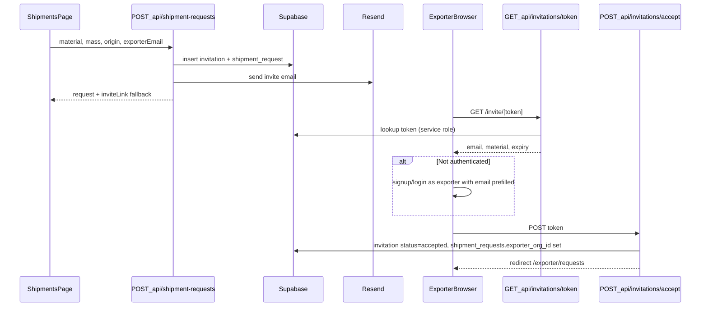

# Day 5 — Invitations + Shipment Request Creation

## Goal

An importer creates a shipment request and invites an exporter by email. The exporter receives a link, lands on `/invite/[token]`, signs up or signs in as **Exporter**, accepts the invite, and is redirected to the exporter portal with the request linked to their org.

**Exit criteria (from [days_3-7_bridge_sprint plan](.cursor/plans/days_3-7_bridge_sprint_dc5c1729.plan.md)):**
- Importer submits form on `/shipments` → `shipment_requests` + `invitations` rows created
- Exporter receives email with link to `/invite/[token]`
- Invite link validates token, supports signup/login, accept links `exporter_org_id`
- Importer sees new request in table with **Pending** badge
- `npm run build` passes

**Out of scope (Day 6):** exporter submission form, accept→import_log, submission notification email, dashboard bridge activity.

---

## Starting point (already done)

| Area | Status |
|------|--------|
| DB tables + RLS | [`supabase/migrations/20260626000000_bridge_schema.sql`](supabase/migrations/20260626000000_bridge_schema.sql) — `invitations`, `shipment_requests`, exporter email/org policies |
| Types + mappers | [`src/types/shipment-request.ts`](src/types/shipment-request.ts), [`src/lib/shipment-request-store.ts`](src/lib/shipment-request-store.ts) |
| API context | [`requireImporterContext()`](src/lib/auth/api-context.ts) / `requireExporterContext()` |
| Importer nav + placeholder | [`src/app/(dashboard)/shipments/page.tsx`](src/app/(dashboard)/shipments/page.tsx) — replace "coming next" UI |
| Dual auth + routing | Day 4 complete — `/shipments` protected for importers only |
| Form constants | Reuse `MATERIAL_TYPES`, `ORIGIN_COUNTRIES` from [`src/types/import-record.ts`](src/types/import-record.ts) |

**Gap to solve:** RLS has no anonymous token lookup. Exporters can only read invitations when `lower(email) = auth_user_email()`. The public invite page needs a **server-only** token validation path before login.

---

## Architecture



---

## Step 1 — Validation schema + env setup

**New file:** [`src/lib/shipment-request-schema.ts`](src/lib/shipment-request-schema.ts)

Zod schema for create payload:
- `materialType` — enum from `MATERIAL_TYPES`
- `mass` — positive number
- `originCountry` — enum from `ORIGIN_COUNTRIES`
- `exporterEmail` — valid email, normalized lowercase
- `cnCode` — optional string
- `referenceNumber`, `notes` — optional strings

**Dependencies:** add `resend` package.

**Env vars** (document in `.env.local.example`; user adds to `.env.local`):
```
RESEND_API_KEY=re_...
NEXT_PUBLIC_APP_URL=http://localhost:3000
RESEND_FROM_EMAIL=CBAMVault <onboarding@resend.dev>   # dev default; custom domain in prod
```

---

## Step 2 — Server-only Supabase admin client (token lookup only)

**New file:** [`src/lib/supabase/admin.ts`](src/lib/supabase/admin.ts)

- Create service-role client using `SUPABASE_SERVICE_ROLE_KEY` (already in [`.env.local`](.env.local))
- Export `isAdminConfigured()` guard
- **Use only in:** public token lookup route — not in routine authenticated CRUD (Day 3 guidance)

**New file:** [`src/lib/invitations/lookup-invitation.ts`](src/lib/invitations/lookup-invitation.ts)

- `lookupInvitationByToken(token)` — fetch invitation + linked shipment request summary
- Return only safe public fields: `email`, `status`, `expiresAt`, `materialType`, `mass`, `originCountry`, `isExpired`
- Reject invalid/expired/revoked tokens with typed errors

---

## Step 3 — API routes

Follow pattern from [`src/app/api/import-logs/route.ts`](src/app/api/import-logs/route.ts).

### `POST /api/shipment-requests`

**File:** [`src/app/api/shipment-requests/route.ts`](src/app/api/shipment-requests/route.ts)

- Guard: `requireImporterContext()`
- Validate body with Zod
- Generate token: `crypto.randomUUID()` (URL-safe, unique per DB constraint)
- Set `expires_at` = now + 14 days
- Insert **invitation** then **shipment_request** (link via `invitation_id`; store normalized `exporter_email`)
- Call [`src/lib/email/send-invitation.ts`](src/lib/email/send-invitation.ts)
- Response: `{ request, invitation, inviteLink, emailSent }`
- On Resend failure: still return 201 with `emailSent: false` and `inviteLink` so importer can copy manually (pilot fallback from sprint plan)

### `GET /api/shipment-requests`

**Same file**

- Importer: `requireImporterContext()` → list org requests, newest first
- Exporter: `requireExporterContext()` → list requests where RLS allows (linked org or matching email)
- Map rows via [`mapRowToShipmentRequest`](src/lib/shipment-request-store.ts)

### `GET /api/invitations/[token]/route.ts`

- **Public** — no auth required
- Admin lookup by token; return safe metadata or 404/410 for expired

### `POST /api/invitations/accept/route.ts`

- Guard: `requireExporterContext()`
- Body: `{ token: string }`
- Verify invitation: status `pending`, not expired, `lower(email) === user.email`
- Transactional updates (sequential with error rollback messaging):
  1. `invitations.status = 'accepted'`
  2. `shipment_requests.exporter_org_id = context.organizationId` for rows with matching `invitation_id`
- Return `{ accepted: true, requestIds: string[] }`

**Middleware update:** [`src/lib/supabase/middleware.ts`](src/lib/supabase/middleware.ts)

- Add protected API paths: `/api/shipment-requests`, `/api/invitations/accept`
- Keep `/api/invitations/[token]` and `/invite/*` **public** (no auth redirect)
- Do **not** redirect authenticated users away from `/invite/[token]` before accept completes (exception to auth-route redirect, or handle accept inside page before middleware home redirect)

---

## Step 4 — Resend email

**New file:** [`src/lib/email/send-invitation.ts`](src/lib/email/send-invitation.ts)

- Use Resend SDK
- Subject: `CBAMVault: Emission data requested for [materialType] shipment`
- HTML body: importer org name (from context), material, mass, origin, CTA button → `${NEXT_PUBLIC_APP_URL}/invite/${token}`
- Plain-text fallback link
- Return `{ ok: boolean, error?: string }` — never throw; caller decides UX

---

## Step 5 — Importer Shipments UI

Replace placeholder in [`src/app/(dashboard)/shipments/page.tsx`](src/app/(dashboard)/shipments/page.tsx) with a client wrapper.

**New components:**

| File | Purpose |
|------|---------|
| [`src/components/shipments/shipment-request-form.tsx`](src/components/shipments/shipment-request-form.tsx) | Create form — mirrors [`import-form.tsx`](src/components/imports/import-form.tsx) patterns (Select for material/origin, Input for mass/email/CN/reference/notes) |
| [`src/components/shipments/shipment-requests-table.tsx`](src/components/shipments/shipment-requests-table.tsx) | Table with status badges using `SHIPMENT_STATUS_LABELS`; columns: material, mass, origin, exporter email, status, created |
| [`src/components/shipments/shipments-page-content.tsx`](src/components/shipments/shipments-page-content.tsx) | Client page: form + table, fetch on mount, toast on create |

**UX details:**
- On success toast: "Invitation sent" or "Request created — copy invite link" when email fails
- Show copyable invite link in a collapsible alert when `emailSent === false`
- Status badge colors: amber `pending_exporter`, blue `submitted`, green `accepted` (reuse Day 6 palette early for consistency)
- Empty state when no requests yet

**Optional context (keep simple):** fetch directly in page component via `fetch('/api/shipment-requests')` — no new global provider needed for Day 5.

---

## Step 6 — Invite landing page

**New route:** [`src/app/(auth)/invite/[token]/page.tsx`](src/app/(auth)/invite/[token]/page.tsx)

Server component fetches token metadata via admin lookup (or client fetch to public API).

**States:**
1. **Invalid/expired token** — error card with link to `/login?role=exporter`
2. **Valid + not logged in** — show shipment summary (material, mass, origin) + CTAs:
   - "Create Exporter account" → `/signup?role=exporter&email=...&redirect=/invite/[token]`
   - "Sign in" → `/login?role=exporter&email=...&redirect=/invite/[token]`
3. **Logged in, email mismatch** — clear error: "Sign in with the invited email: …"
4. **Logged in, email matches** — auto-call accept (client) or "Accept invitation" button → POST accept → redirect `/exporter/requests` with success toast

**Auth form tweak:** [`src/components/auth/auth-form.tsx`](src/components/auth/auth-form.tsx)

- Read optional `email` search param → pre-fill email field (readonly on signup from invite)
- After login/signup with `redirect=/invite/[token]`, return to invite page to run accept (don't skip accept step)

---

## Step 7 — Middleware + auth edge cases

| Scenario | Behavior |
|----------|----------|
| Importer hits `/invite/[token]` | Allow (public); show "This invite is for exporters" if they try to accept |
| Exporter already logged in opens invite | Accept flow runs |
| Exporter signs up with wrong email | Accept API rejects; show mismatch message |
| Duplicate invite to same email | Allow multiple requests; each gets its own token |

**Invite route placement:** under `(auth)` layout for consistent branding — same shell as login/signup.

---

## Files summary

| Action | Path |
|--------|------|
| Create | `src/lib/shipment-request-schema.ts` |
| Create | `src/lib/supabase/admin.ts` |
| Create | `src/lib/invitations/lookup-invitation.ts` |
| Create | `src/lib/email/send-invitation.ts` |
| Create | `src/app/api/shipment-requests/route.ts` |
| Create | `src/app/api/invitations/[token]/route.ts` |
| Create | `src/app/api/invitations/accept/route.ts` |
| Create | `src/components/shipments/shipment-request-form.tsx` |
| Create | `src/components/shipments/shipment-requests-table.tsx` |
| Create | `src/components/shipments/shipments-page-content.tsx` |
| Create | `src/app/(auth)/invite/[token]/page.tsx` |
| Modify | `src/app/(dashboard)/shipments/page.tsx` |
| Modify | `src/components/auth/auth-form.tsx` |
| Modify | `src/lib/supabase/middleware.ts` |
| Modify | `package.json` (add `resend`) |
| Create | `.env.local.example` |

**No new migration expected** — schema and RLS from Day 3 are sufficient.

---

## Manual QA checklist

- [ ] Importer creates request on `/shipments` → row appears with **Pending** status
- [ ] Email arrives (or invite link shown for manual copy when Resend key missing)
- [ ] `/invite/[token]` shows shipment details for valid token
- [ ] Expired/invalid token shows error
- [ ] New exporter signs up via invite link → accept → lands on `/exporter/requests`
- [ ] Existing exporter signs in via invite link → accept → request linked
- [ ] Wrong email on login → accept blocked with clear message
- [ ] Importer cannot access `/exporter/*`; exporter cannot access `/shipments` (Day 4 guards still hold)
- [ ] `npm run build` clean

---

## Handoff to Day 6

Day 5 delivers **request creation + invitation acceptance**. Day 6 wires:
- Exporter stat cards + request list from real `GET /api/shipment-requests` data
- [`src/app/exporter/requests/[id]/page.tsx`](src/app/exporter/requests/[id]/page.tsx) submission form
- `PATCH /api/shipment-requests/[id]` for submit/accept/reject
- Importer dashboard bridge activity + accept→import_log flow
