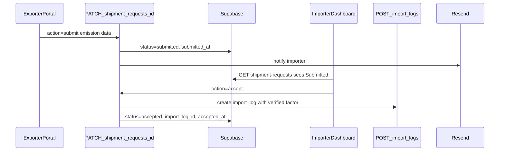
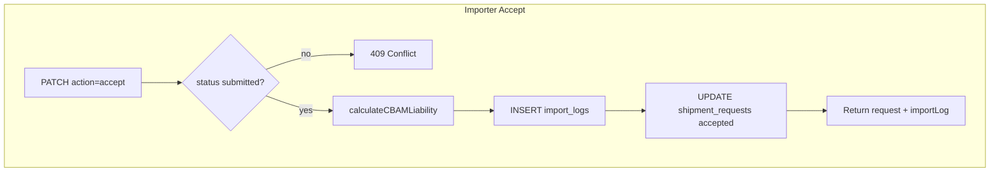

# Day 6 — Exporter Submission + Importer Status Tracking

## Goal

Complete the bridge MVP loop:



**Exit criteria (from [days_3-7_bridge_sprint plan](.cursor/plans/days_3-7_bridge_sprint_dc5c1729.plan.md)):**
- Exporter dashboard + My Requests show real data after invite accept
- Exporter submits emission factor → status **Submitted**
- Importer sees submission on `/shipments` and dashboard **Bridge Activity**
- Importer accepts → `import_log` created with verified `emission_factor` → status **Accepted**
- Importer receives email on submission (Resend, with manual fallback pattern from Day 5)
- `npm run build` passes

**Out of scope (Day 7):** full polish pass, deploy, runbook, two-user production QA, stale copy removal.

---

## Starting point (Day 5 done)

| Area | Status |
|------|--------|
| `GET/POST /api/shipment-requests` | [`src/app/api/shipment-requests/route.ts`](src/app/api/shipment-requests/route.ts) — list works for both roles |
| Exporter pages | [`src/app/exporter/page.tsx`](src/app/exporter/page.tsx), [`src/app/exporter/requests/page.tsx`](src/app/exporter/requests/page.tsx) — **hardcoded placeholders** |
| Importer shipments UI | [`src/components/shipments/shipments-page-content.tsx`](src/components/shipments/shipments-page-content.tsx) — live list, no accept/reject |
| Importer dashboard | [`src/app/(dashboard)/page.tsx`](src/app/(dashboard)/page.tsx) — no bridge section |
| Types + badges | [`src/types/shipment-request.ts`](src/types/shipment-request.ts), [`src/components/shipments/shipment-requests-table.tsx`](src/components/shipments/shipment-requests-table.tsx) |
| CBAM engine | [`src/lib/cbam-calculator.ts`](src/lib/cbam-calculator.ts), [`src/lib/imports-store.ts`](src/lib/imports-store.ts) |
| Email | [`src/lib/email/send-invitation.ts`](src/lib/email/send-invitation.ts) — reuse Resend pattern |

**Known blocker from Day 5 QA:** invitation accept fails RLS because `"exporters accept invitations"` UPDATE policy lacks a `WITH CHECK` allowing `status = 'accepted'`. Fix this **first** in a new migration before building submit/accept flows.

---

## Step 0 — RLS migration fix (prerequisite)

**New file:** `supabase/migrations/20260627000000_fix_invitation_accept_rls.sql`

Fix invitation accept policy:

```sql
DROP POLICY IF EXISTS "exporters accept invitations" ON public.invitations;

CREATE POLICY "exporters accept invitations"
  ON public.invitations FOR UPDATE
  USING (
    lower(email) = public.auth_user_email()
    AND status = 'pending'
  )
  WITH CHECK (
    lower(email) = public.auth_user_email()
    AND status = 'accepted'
  );
```

Audit exporter submit policy on `shipment_requests` — add explicit `WITH CHECK` so a row can transition `pending_exporter → submitted` while `exporter_org_id` is set:

```sql
-- USING: can touch row when linked org OR email match + pending/submitted
-- WITH CHECK: after submit, status=submitted + same org/email guard
```

Apply to hosted Supabase (`supabase db push` or SQL Editor). Without this, accept/submit PATCH calls will fail silently or with RLS errors.

---

## Step 1 — Validation schemas + shared helpers

**New file:** [`src/lib/shipment-submission-schema.ts`](src/lib/shipment-submission-schema.ts)

Zod schemas for PATCH body discriminated by `action`:

| Action | Role | Fields |
|--------|------|--------|
| `submit` | exporter | `emissionFactor` (required, ≥ 0), optional `directEmissions`, `indirectEmissions`, `submissionNotes` |
| `accept` | importer | none (server reads submission from row) |
| `reject` | importer | optional `reason` string stored in notes or submission_notes |

**New file:** [`src/lib/build-import-from-shipment.ts`](src/lib/build-import-from-shipment.ts)

Extract import-record building from [`src/context/imports-context.tsx`](src/context/imports-context.tsx) (currently private `buildImportRecord`). Used by accept handler:

1. Input: `ShipmentRequest` with submitted `emissionFactor`
2. Call `calculateCBAMLiability({ materialType, mass, emissionFactor, foreignPrice: 0 })`
3. Return `ImportRecord` ready for `mapImportToInsert(record, importerOrgId)`

Keeps accept logic server-side; no client-side calculation trust.

---

## Step 2 — API routes

### `GET /api/shipment-requests/[id]`

**New file:** [`src/app/api/shipment-requests/[id]/route.ts`](src/app/api/shipment-requests/[id]/route.ts)

- Guard: `getApiContext()` — both roles
- Fetch single row by id; RLS enforces org/email access
- Return `{ request: ShipmentRequest }` or 404

### `PATCH /api/shipment-requests/[id]`

**Same file**

Role-gated actions:

**Exporter `submit`:**
- Guard: `requireExporterContext()`
- Row must have `exporter_org_id = context.organizationId` (post-invite-accept)
- Row `status` must be `pending_exporter`
- Update: `emission_factor`, `direct_emissions`, `indirect_emissions`, `submission_notes`, `status = 'submitted'`, `submitted_at = now()`
- Call [`src/lib/email/send-submission-notification.ts`](src/lib/email/send-submission-notification.ts) → importer org contact
- Response: `{ request, emailSent?, emailError? }`

**Importer `accept`:**
- Guard: `requireImporterContext()`
- Row `importer_org_id` must match; `status` must be `submitted`; `emission_factor` not null
- Create `import_log` via `calculateCBAMLiability` + `mapImportToInsert` (new uuid)
- Update request: `status = 'accepted'`, `accepted_at = now()`, `import_log_id = newLog.id`
- Response: `{ request, importLog }`

**Importer `reject`:**
- Guard: `requireImporterContext()`
- Row `status` must be `submitted`
- Update: `status = 'rejected'`, append rejection reason to `submission_notes`
- Response: `{ request }`

**Middleware:** existing `/api/shipment-requests` prefix already protects `[id]` routes — no change needed.

---

## Step 3 — Submission notification email

**New file:** [`src/lib/email/send-submission-notification.ts`](src/lib/email/send-submission-notification.ts)

Mirror Day 5 pattern from [`src/lib/email/send-invitation.ts`](src/lib/email/send-invitation.ts):

- Subject: `CBAMVault: Emission data submitted for [materialType] shipment`
- Body: exporter email, material, mass, emission factor, CTA → `${NEXT_PUBLIC_APP_URL}/shipments`
- Return `{ ok, error?, devRedirected? }` — never throw
- Lookup importer notification email from `profiles` (org owner) or fallback to org metadata

---

## Step 4 — Shared UI components

Refactor and extend existing shipment components rather than duplicating.

| File | Purpose |
|------|---------|
| [`src/components/shipments/shipment-status-badge.tsx`](src/components/shipments/shipment-status-badge.tsx) | Extract badge + `STATUS_STYLES` from table |
| [`src/components/shipments/shipment-requests-table.tsx`](src/components/shipments/shipment-requests-table.tsx) | Add `variant: "importer" \| "exporter"` — exporter columns: material, mass, origin, status, deadline/submitted, **View/Submit link**; importer columns: existing + **Review** for submitted |
| [`src/components/shipments/exporter-request-stats.tsx`](src/components/shipments/exporter-request-stats.tsx) | Stat cards computed from request array |
| [`src/components/shipments/shipment-submission-form.tsx`](src/components/shipments/shipment-submission-form.tsx) | Exporter form: read-only shipment summary + editable emission fields |
| [`src/components/shipments/importer-review-panel.tsx`](src/components/shipments/importer-review-panel.tsx) | Submitted data summary + Accept / Reject buttons |
| [`src/components/shipments/bridge-activity.tsx`](src/components/shipments/bridge-activity.tsx) | Dashboard widget: last 5 requests with status badges + link to `/shipments` |
| [`src/components/shipments/use-shipment-requests.ts`](src/components/shipments/use-shipment-requests.ts) | Shared hook: fetch, loading, error, refetch |

---

## Step 5 — Exporter portal (wire real data)

### Dashboard [`src/app/exporter/page.tsx`](src/app/exporter/page.tsx)

Replace static placeholders with client wrapper [`src/components/shipments/exporter-dashboard-content.tsx`](src/components/shipments/exporter-dashboard-content.tsx):

- Fetch `GET /api/shipment-requests` on mount
- Live stat cards: count by `pending_exporter`, `submitted`, `accepted`, `rejected`
- Recent requests table (top 5, link to full list)
- Remove "coming in next release" banner

### My Requests [`src/app/exporter/requests/page.tsx`](src/app/exporter/requests/page.tsx)

Replace placeholder with [`src/components/shipments/exporter-requests-content.tsx`](src/components/shipments/exporter-requests-content.tsx):

- Full table from `useShipmentRequests()`
- Status filter tabs (All / Pending / Submitted / Accepted / Rejected) — client-side filter
- Row click or **Submit** button → `/exporter/requests/[id]`
- Empty state when no linked requests (post-accept should show rows)

### Submission detail [`src/app/exporter/requests/[id]/page.tsx`](src/app/exporter/requests/[id]/page.tsx)

- Server component loads request via `GET /api/shipment-requests/[id]` or admin-safe fetch
- States:
  - **pending_exporter** → show `ShipmentSubmissionForm`, POST PATCH `submit`
  - **submitted** → read-only "Awaiting importer review"
  - **accepted/rejected** → read-only outcome + link back to list
- Toast on success; redirect to `/exporter/requests`

---

## Step 6 — Importer status tracking + accept flow

### Shipments page enhancements

Update [`src/components/shipments/shipments-page-content.tsx`](src/components/shipments/shipments-page-content.tsx):

- For `status === 'submitted'` rows: expand row or slide-over with `ImporterReviewPanel`
- Accept → PATCH `accept` → toast "Import log created" + refresh list
- Reject → PATCH `reject` → toast + refresh
- Optional: link to created import on `/import-logs` after accept

### Dashboard bridge activity

Update [`src/app/(dashboard)/page.tsx`](src/app/(dashboard)/page.tsx):

- Add `<BridgeActivity />` between `StatCards` and import form grid
- Shows recent shipment requests with exporter email + status badge
- "View all" → `/shipments`

---

## Step 7 — UX polish (Day 6 scope only)

- Loading skeletons on exporter dashboard, requests list, submission page
- Toasts: submit success, accept success (with liability preview snippet), reject confirmation
- Disable double-submit on forms (`isLoading` guard)
- Show submitted emission factor + direct/indirect breakdown in importer review panel
- After accept, badge on shipments table shows **Accepted** with optional `importLogId` tooltip

---

## Architecture: accept → import_log



Key fields mapped from submission → import log:

- `material_type`, `mass`, `origin_country` from request
- `emission_factor` from exporter submission (verified source)
- `foreign_price = 0` (no proof flow on bridge accept — importer can edit later on import-logs)
- Full CBAM calculation via existing engine

---

## Files summary

| Action | Path |
|--------|------|
| Create | `supabase/migrations/20260627000000_fix_invitation_accept_rls.sql` |
| Create | `src/lib/shipment-submission-schema.ts` |
| Create | `src/lib/build-import-from-shipment.ts` |
| Create | `src/lib/email/send-submission-notification.ts` |
| Create | `src/app/api/shipment-requests/[id]/route.ts` |
| Create | `src/components/shipments/shipment-status-badge.tsx` |
| Create | `src/components/shipments/exporter-request-stats.tsx` |
| Create | `src/components/shipments/shipment-submission-form.tsx` |
| Create | `src/components/shipments/importer-review-panel.tsx` |
| Create | `src/components/shipments/bridge-activity.tsx` |
| Create | `src/components/shipments/use-shipment-requests.ts` |
| Create | `src/components/shipments/exporter-dashboard-content.tsx` |
| Create | `src/components/shipments/exporter-requests-content.tsx` |
| Create | `src/app/exporter/requests/[id]/page.tsx` |
| Modify | `src/app/exporter/page.tsx` |
| Modify | `src/app/exporter/requests/page.tsx` |
| Modify | `src/components/shipments/shipment-requests-table.tsx` |
| Modify | `src/components/shipments/shipments-page-content.tsx` |
| Modify | `src/app/(dashboard)/page.tsx` |
| Modify | `src/context/imports-context.tsx` (optional: import shared `buildImportRecord`) |

**No new tables** — schema from Day 3 is sufficient.

---

## Manual QA checklist

- [ ] Apply RLS migration; exporter can accept invitation without RLS error
- [ ] Accepted request appears on `/exporter/requests` with **Pending** status
- [ ] Exporter opens `/exporter/requests/[id]`, submits emission factor → **Submitted**
- [ ] Importer `/shipments` shows **Submitted** badge + review panel
- [ ] Importer dashboard **Bridge Activity** shows the request
- [ ] Importer accepts → new row on `/import-logs` with verified emission factor + CBAM liability calculated
- [ ] Shipment request shows **Accepted** + linked import
- [ ] Importer rejects submitted request → exporter sees **Rejected**
- [ ] Submission email sent (or fallback message if Resend sandbox)
- [ ] Cross-role guards hold (exporter cannot accept import; importer cannot submit)
- [ ] `npm run build` clean

---

## Handoff to Day 7

Day 6 delivers the **full happy-path loop**. Day 7 focuses on:

- Empty/loading/error states audit across all bridge pages
- Remove stale "coming next" / Phase 2 copy
- Two-account end-to-end QA on production
- Deploy + `docs/PILOT_RUNBOOK.md` bridge workflow
- Tag `v0.2.0-bridge-mvp`

---

## Risks and mitigations

| Risk | Mitigation |
|------|------------|
| RLS UPDATE `WITH CHECK` breaks submit/accept | Fix in Step 0 migration; test both flows before UI |
| Accept creates duplicate import logs | Guard: reject accept if `import_log_id` already set |
| Exporter can't see requests after accept | Verify `exporter_org_id` set on accept + exporter read RLS |
| Email sandbox blocks importer notification | Reuse Day 5 dev redirect + surface `emailError` in toast |
| `buildImportRecord` duplication | Single shared helper in `build-import-from-shipment.ts` |
