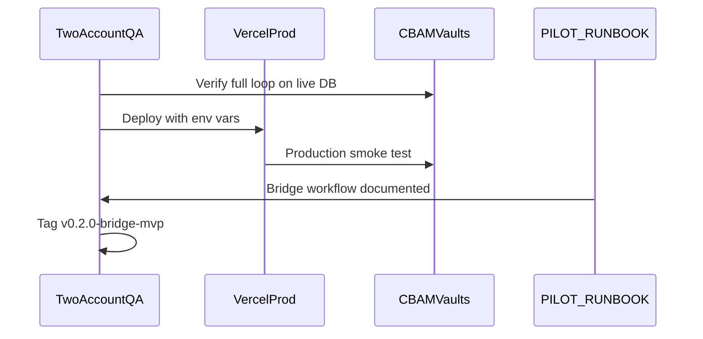

# Day 7 — Polish, QA, Deploy (Final Bridge Sprint Day)

## Goal

Ship a **production-ready bridge MVP** with a documented end-to-end workflow. Per [days_3-7_bridge_sprint plan](.cursor/plans/days_3-7_bridge_sprint_dc5c1729.plan.md):



**Exit criteria:**
- Live Vercel URL; importer–exporter loop works end-to-end on production
- All bridge pages have consistent loading / empty / error UX
- No stale MVP-only or "coming soon" copy
- [`docs/PILOT_RUNBOOK.md`](docs/PILOT_RUNBOOK.md) documents the full bridge workflow
- All Supabase migrations applied on **CBAMVaults** (`kkgsitommexetmfmgxba`)
- `npm run build` passes
- Git tag `v0.2.0-bridge-mvp`

**Out of scope (post-sprint backlog):** customs ingest, multilingual portal, AI extraction, financial forecasting, EU XSD validation, Stripe, team invites.

---

## Starting point (Day 6 done)

| Area | Status |
|------|--------|
| Full bridge loop | Submit → notify → review → accept → `import_log` implemented |
| Exporter portal | Live data on [`src/app/exporter/page.tsx`](src/app/exporter/page.tsx), requests list, submission detail |
| Importer bridge | Review/accept/reject on [`src/components/shipments/shipments-page-content.tsx`](src/components/shipments/shipments-page-content.tsx), [`BridgeActivity`](src/components/shipments/bridge-activity.tsx) on dashboard |
| RLS fix | Applied to CBAMVaults via SQL; local file [`supabase/migrations/20260627000000_fix_invitation_accept_rls.sql`](supabase/migrations/20260627000000_fix_invitation_accept_rls.sql) exists |
| Build | `npm run build` already passes |
| Stale UI copy | No "Phase 2" / "coming next" strings remain in `src/` |
| Runbook | [`docs/PILOT_RUNBOOK.md`](docs/PILOT_RUNBOOK.md) is **outdated** — still describes MVP-only, no bridge, tag `v0.1.0-mvp` |
| Env docs | No `.env.local.example`; Resend sandbox vars undocumented |
| Package version | Still `0.1.0` in [`package.json`](package.json) |

---

## Step 0 — Supabase migration sync (prerequisite)

Ensure **CBAMVaults** has all four migrations recorded and applied:

| Migration | Purpose |
|-----------|---------|
| `20260625000000_mvp_schema.sql` | Base schema |
| `20260626000000_bridge_schema.sql` | Bridge tables + RLS |
| `20260626000001_fix_storage_rls.sql` | Storage RLS repair |
| `20260627000000_fix_invitation_accept_rls.sql` | Invitation accept + exporter submit RLS |

Day 6 applied the RLS fix via direct SQL — verify it is also registered in Supabase migration history (via `apply_migration` or `supabase db push`) so future deploys stay in sync.

**Verify policies exist:**
```sql
SELECT policyname FROM pg_policies
WHERE tablename IN ('invitations', 'shipment_requests')
ORDER BY tablename, policyname;
```

---

## Step 1 — UX polish audit (bridge pages only)

Day 6 built the loop; Day 7 tightens edge UX. Focus on gaps, not rewrites.

### 1a. Error states with retry

Pages using [`useShipmentRequests`](src/components/shipments/use-shipment-requests.ts) show plain error text. Add a lightweight **Retry** button that calls `refetch()` on:

- [`exporter-dashboard-content.tsx`](src/components/shipments/exporter-dashboard-content.tsx)
- [`exporter-requests-content.tsx`](src/components/shipments/exporter-requests-content.tsx)
- [`shipments-page-content.tsx`](src/components/shipments/shipments-page-content.tsx)
- [`bridge-activity.tsx`](src/components/shipments/bridge-activity.tsx)

### 1b. Post-accept importer feedback

After accept in [`importer-review-panel.tsx`](src/components/shipments/importer-review-panel.tsx):
- Toast already shows liability — add optional **"View import log"** action linking to `/import-logs`
- On importer shipments table: for `status === 'accepted'` rows, show linked import badge or tooltip using `importLogId` from [`ShipmentRequest`](src/types/shipment-request.ts)

### 1c. Submission notification feedback

[`shipment-submission-form.tsx`](src/components/shipments/shipment-submission-form.tsx) ignores `emailSent` / `emailError` from PATCH response. Mirror the invite form pattern in [`shipment-request-form.tsx`](src/components/shipments/shipment-request-form.tsx):
- Success + email sent → standard toast
- Success + email failed → warning toast with fallback message

### 1d. Loading skeleton consistency

Replace generic "Loading…" blocks on [`shipments-page-content.tsx`](src/components/shipments/shipments-page-content.tsx) with skeleton rows matching exporter dashboard style.

### 1e. Final copy sweep

Re-grep `src/` for: `Phase 2`, `coming next`, `demo`, `placeholder page`, `in-memory`. Confirm [`docs/PILOT_RUNBOOK.md`](docs/PILOT_RUNBOOK.md) "Known limitations" no longer claims "No supplier/exporter bridge".

---

## Step 2 — Two-account production QA

Run on **localhost against CBAMVaults** first, then repeat on **Vercel production URL** after deploy.

### Test accounts

| Role | Suggested email | Notes |
|------|-----------------|-------|
| Importer | `importer-test@…` | Sign up as Importer |
| Exporter | `exporter-test@…` | Must match invite email exactly |

Use two browsers (normal + incognito) or two profiles.

### QA checklist (from sprint plan + Day 6 handoff)

**Auth & routing**
- [ ] Importer signup → lands on importer dashboard (`/`)
- [ ] Exporter signup → lands on exporter portal (`/exporter`)
- [ ] Cross-role access blocked by middleware ([`src/lib/supabase/middleware.ts`](src/lib/supabase/middleware.ts))

**Invite + request flow**
- [ ] Importer creates shipment on `/shipments` → invitation email sent (or invite link shown as fallback)
- [ ] Exporter opens `/invite/[token]` → accepts → sees request on `/exporter/requests` as **Pending**
- [ ] Invitation accept succeeds without RLS error (Day 6 fix)

**Submission loop**
- [ ] Exporter opens `/exporter/requests/[id]` → submits emission factor → status **Submitted**
- [ ] Importer `/shipments` shows **Submitted** + review panel works
- [ ] Importer dashboard **Bridge Activity** shows the request
- [ ] Importer receives submission notification email (or dev sandbox redirect)

**Accept + import log**
- [ ] Importer accepts → toast shows liability → new row on `/import-logs` with verified `emission_factor`
- [ ] Shipment request shows **Accepted** + `importLogId` linked
- [ ] Importer rejects a separate submitted request → exporter sees **Rejected**

**Downstream compliance**
- [ ] Accepted import appears in **Emissions Reports** import picker
- [ ] Quarterly report can be generated including the bridge-created import
- [ ] XML export includes org EORI/metadata from Settings

**Security**
- [ ] Importer A cannot see Importer B's requests, imports, or reports
- [ ] Exporter cannot call accept/submit on another org's requests (403)
- [ ] Importer cannot PATCH `action=submit`

**Build**
- [ ] `npm run build` clean

---

## Step 3 — Environment & deploy prep

### 3a. Create `.env.local.example`

Document all required vars for bridge MVP:

```
NEXT_PUBLIC_SUPABASE_URL=
NEXT_PUBLIC_SUPABASE_ANON_KEY=
NEXT_PUBLIC_APP_URL=http://localhost:3000
RESEND_API_KEY=
RESEND_FROM_EMAIL=CBAMVault <onboarding@resend.dev>
RESEND_DEV_INBOX=          # optional: Resend sandbox redirect inbox
CBAM_ETS_PRICE=80          # optional
```

Do **not** commit `.env.local` (contains secrets).

### 3b. Bump version

Update [`package.json`](package.json) version to `0.2.0`.

### 3c. Vercel deployment

1. Connect repo to Vercel (or use existing project)
2. Set production env vars (same as above; `NEXT_PUBLIC_APP_URL` = Vercel URL)
3. Deploy from main branch
4. Post-deploy: update Supabase Auth **Site URL** and **Redirect URLs** to include Vercel domain
5. Smoke test signup on production URL

**Note:** `SUPABASE_SERVICE_ROLE_KEY` is used server-side for invite lookup ([`lookupInvitationByToken`](src/lib/invitations/lookup-invitation.ts)) — add to Vercel env if not already set.

---

## Step 4 — Update pilot runbook

Rewrite [`docs/PILOT_RUNBOOK.md`](docs/PILOT_RUNBOOK.md) to cover the full bridge workflow. Replace outdated sections:

**Remove / update:**
- "No supplier/exporter collaborative bridge" → now in scope
- Tag reference `v0.1.0-mvp` → `v0.2.0-bridge-mvp`
- Prerequisites: list all 4 migrations, not just MVP schema

**Add new sections:**

1. **Bridge prerequisites** — Resend API key, `NEXT_PUBLIC_APP_URL`, CBAMVaults project
2. **Two-account setup** — create importer + exporter test accounts
3. **Importer workflow** — Settings → create shipment request → share invite link if email fails
4. **Exporter workflow** — accept invite → submit emission data
5. **Accept workflow** — review on `/shipments` → accept → verify import log
6. **Email sandbox notes** — `RESEND_DEV_INBOX` for local/pilot testing with `@resend.dev` sender
7. **Production deployment checklist** — env vars, migration list, smoke test, tag
8. **Known bridge MVP limitations** — no team invites, no magic-link-only auth, no XSD validation, etc.

Optionally add a short `docs/BRIDGE_QA_CHECKLIST.md` mirroring Step 2 for repeatable pilot testing.

---

## Step 5 — Release tag

After production QA passes:

```bash
git tag -a v0.2.0-bridge-mvp -m "Bridge MVP: importer-exporter shipment loop"
git push origin v0.2.0-bridge-mvp
```

Update runbook release reference to match.

---

## Files summary

| Action | Path |
|--------|------|
| Modify | [`src/components/shipments/exporter-dashboard-content.tsx`](src/components/shipments/exporter-dashboard-content.tsx) — error retry |
| Modify | [`src/components/shipments/exporter-requests-content.tsx`](src/components/shipments/exporter-requests-content.tsx) — error retry |
| Modify | [`src/components/shipments/shipments-page-content.tsx`](src/components/shipments/shipments-page-content.tsx) — skeleton + retry |
| Modify | [`src/components/shipments/bridge-activity.tsx`](src/components/shipments/bridge-activity.tsx) — error retry |
| Modify | [`src/components/shipments/importer-review-panel.tsx`](src/components/shipments/importer-review-panel.tsx) — post-accept link |
| Modify | [`src/components/shipments/shipment-requests-table.tsx`](src/components/shipments/shipment-requests-table.tsx) — accepted import link |
| Modify | [`src/components/shipments/shipment-submission-form.tsx`](src/components/shipments/shipment-submission-form.tsx) — email feedback toast |
| Modify | [`docs/PILOT_RUNBOOK.md`](docs/PILOT_RUNBOOK.md) — full bridge rewrite |
| Create | `.env.local.example` |
| Modify | [`package.json`](package.json) — version `0.2.0` |
| Optional | `docs/BRIDGE_QA_CHECKLIST.md` |

**No new tables or API routes** — Day 7 is polish, QA, docs, and deploy only.

---

## Risks and mitigations

| Risk | Mitigation |
|------|------------|
| Resend sandbox blocks production emails | Document manual invite-link fallback; verify custom domain before pilot |
| Migration history out of sync on CBAMVaults | Step 0 verification + `list_migrations` before deploy |
| Production Auth redirect mismatch | Update Supabase Site URL + redirect allowlist after Vercel deploy |
| QA blocked by email mismatch on invite accept | Exporter account email must exactly match invite email |
| Scope creep into post-sprint features | Lock exit to one happy-path loop; backlog everything else |

---

## Handoff beyond Day 7

Post-sprint roadmap from the bridge sprint plan:

1. Customs declaration ingest (MRN/BOL)
2. Plausibility checks on exporter submissions
3. Multi-year financial forecasting
4. EU Registry XSD validation
5. Stripe billing
6. Multilingual exporter portal
