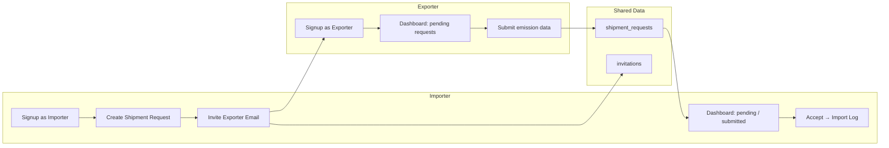

# Days 3–7 — Importer–Exporter Bridge Sprint

## Where we are today

**Done (Days 1–2 + partial original Days 3–6):**
- Multi-tenant schema, RLS, signup trigger ([`supabase/migrations/20260625000000_mvp_schema.sql`](supabase/migrations/20260625000000_mvp_schema.sql))
- SSR auth, middleware, login/signup/logout ([`src/lib/supabase/middleware.ts`](src/lib/supabase/middleware.ts))
- Org-scoped API routes via [`getApiContext()`](src/lib/auth/api-context.ts)
- Proof upload, reports, XML export, compliance dashboard

**Not built (your bridge vision):**
- Importer vs exporter account types and separate dashboards
- Invitations + email notifications
- Shared `shipments` linking importer requests to exporter submissions
- Status workflow: pending → submitted → accepted

**Architectural decision (confirmed):** **Linked orgs** — each party has their own organization. Collaboration happens through `shipment_requests`, not by joining the same tenant.

---

## Bridge MVP scope (Days 3–7)



### In scope (ship by Day 7)

| Feature | Description |
|---------|-------------|
| Dual account type | Sign up / sign in as **Importer** or **Exporter** |
| Role-based routing | Separate dashboards, nav, middleware guards |
| Shipment requests | Importer creates request (material, mass, origin, CN code, exporter email) |
| Email invitations | Exporter receives invite link; can sign up or sign in to respond |
| Exporter portal | Clean dashboard: pending / submitted requests, submission form |
| Importer bridge view | Imports list shows linked exporter + status badges |
| Accept flow | Importer accepts submission → creates `import_log` with verified emission factor |
| Email on key events | Invite sent, submission received (via Resend or Supabase Edge Function) |

### Explicitly deferred (post Day 7)

- Automated customs declaration ingest (MRN/BOL filtering)
- Multilingual portal
- Intelligent PDF/data extraction
- Multi-year financial forecasting engine
- Official EU XSD validation
- Stripe billing
- Team invites within org
- Passwordless magic-link-only exporter access (email+password MVP is fine)

---

## Data model (new migration)

New file: `supabase/migrations/20260626000000_bridge_schema.sql`

```sql
-- Org type discriminator
alter table public.organizations
  add column org_type text not null default 'importer'
  check (org_type in ('importer', 'exporter'));

-- Account type stored in auth user metadata + mirrored on profiles
alter table public.profiles
  add column account_type text not null default 'importer'
  check (account_type in ('importer', 'exporter'));

-- Invitations
create table public.invitations (
  id uuid primary key default gen_random_uuid(),
  importer_org_id uuid not null references public.organizations(id),
  email text not null,
  token text not null unique,
  status text not null default 'pending'
    check (status in ('pending', 'accepted', 'expired', 'revoked')),
  expires_at timestamptz not null,
  created_at timestamptz not null default now()
);

-- Bridge entity: shipment request
create table public.shipment_requests (
  id uuid primary key default gen_random_uuid(),
  importer_org_id uuid not null references public.organizations(id),
  exporter_org_id uuid references public.organizations(id),
  invitation_id uuid references public.invitations(id),
  -- Importer-provided fields
  material_type text not null,
  mass numeric not null check (mass > 0),
  origin_country text not null,
  cn_code text,
  reference_number text,
  notes text,
  -- Exporter-submitted fields (null until submitted)
  emission_factor numeric,
  direct_emissions numeric,
  indirect_emissions numeric,
  submission_notes text,
  -- Workflow
  status text not null default 'pending_exporter'
    check (status in (
      'pending_exporter', 'submitted', 'accepted', 'rejected', 'cancelled'
    )),
  submitted_at timestamptz,
  accepted_at timestamptz,
  import_log_id uuid references public.import_logs(id),
  created_at timestamptz not null default now()
);
```

**RLS highlights:**
- Importers: full CRUD on their org's `shipment_requests` and `invitations`
- Exporters: read/update rows where `exporter_org_id` matches their org OR `invitation.email` matches their auth email (on accept, set `exporter_org_id`)
- Cross-org read only on linked shipment rows — never full org access

**Signup trigger change:** [`handle_new_user()`](supabase/migrations/20260625000000_mvp_schema.sql) must read `raw_user_meta_data->>'account_type'` and set `organizations.org_type` + `profiles.account_type` accordingly.

---

## Day-by-day plan

### Day 3 — Schema + dual account foundation

**Goal:** Database supports two org types; signup stores account type; verify existing RLS still holds.

1. Create and apply [`20260626000000_bridge_schema.sql`](supabase/migrations/20260626000000_bridge_schema.sql)
2. Update [`handle_new_user()`](supabase/migrations/20260625000000_mvp_schema.sql) to bootstrap importer vs exporter org based on `account_type` metadata
3. Update [`src/types/database.ts`](src/types/database.ts) with new tables + columns
4. Extend [`getApiContext()`](src/lib/auth/api-context.ts) to return `accountType` and `orgType`
5. Audit existing RLS — run two-user isolation test (importer A cannot see importer B)
6. Remove any remaining service-role usage from routine API paths

**Exit criteria:** Sign up as importer → `org_type = importer`; sign up as exporter → `org_type = exporter`; RLS verified.

---

### Day 4 — Dual auth UI + role-based routing

**Goal:** Login/signup clearly separates Importer and Exporter; middleware routes each to the correct dashboard.

1. Update [`src/components/auth/auth-form.tsx`](src/components/auth/auth-form.tsx):
   - Add toggle/tabs: **Sign in as Importer** | **Sign in as Exporter**
   - Pass `account_type` in `signUp` options: `{ data: { account_type, full_name } }`
   - On login, verify user's `account_type` matches selected role (reject mismatch with clear error)
2. Split route groups:
   - [`src/app/(importer)/`](src/app/(dashboard)/) — move existing dashboard pages here (or rename route group)
   - [`src/app/(exporter)/`](src/app/(exporter)/) — new exporter shell
3. Update [`src/lib/supabase/middleware.ts`](src/lib/supabase/middleware.ts):
   - Importer routes: `/`, `/import-logs`, `/emissions-reports`, `/settings`, `/shipments`
   - Exporter routes: `/exporter`, `/exporter/requests`
   - Redirect wrong role to their home dashboard
4. Create exporter layout: sidebar with Dashboard + My Requests + Settings
5. Keep importer layout unchanged but add **Shipments / Suppliers** nav item

**Exit criteria:** Importer login → importer dashboard; exporter login → exporter dashboard; cross-access blocked.

---

### Day 5 — Invitations + shipment request creation

**Goal:** Importer can create a shipment request and email an exporter invite.

1. **Importer UI** — new page [`src/app/(importer)/shipments/page.tsx`](src/app/(importer)/shipments/page.tsx):
   - Form: material, mass, origin, CN code, exporter email, reference/notes
   - Table: all requests with status badge (pending / submitted / accepted)
2. **API routes:**
   - `POST /api/shipment-requests` — create request + invitation token
   - `GET /api/shipment-requests` — list for current org (importer or exporter view)
   - `POST /api/invitations/accept` — accept token, link exporter org to request
3. **Email** — add [`src/lib/email/send-invitation.ts`](src/lib/email/send-invitation.ts) using **Resend** (add `RESEND_API_KEY` env var):
   - Subject: "CBAMVault: Emission data requested for [material] shipment"
   - Body: invite link → `/invite/[token]`
4. **Invite landing page** [`src/app/(auth)/invite/[token]/page.tsx`](src/app/(auth)/invite/[token]/page.tsx):
   - Valid token → pre-fill exporter signup or prompt login
   - After auth → accept invitation → redirect to exporter dashboard

**Exit criteria:** Importer creates request → exporter receives email → invite link works.

---

### Day 6 — Exporter submission + importer status tracking

**Goal:** Exporter submits verified emissions; importer sees live status updates.

1. **Exporter dashboard** [`src/app/(exporter)/page.tsx`](src/app/(exporter)/page.tsx):
   - Stat cards: Pending count, Submitted count, Accepted count
   - Request table with status badges (color-coded: amber pending, blue submitted, green accepted)
2. **Exporter submission form** [`src/app/(exporter)/requests/[id]/page.tsx`](src/app/(exporter)/requests/[id]/page.tsx):
   - Read-only importer fields (material, mass, origin)
   - Editable: emission factor, direct/indirect emissions, notes
   - Submit → status `submitted`, set `submitted_at`
3. **API:** `PATCH /api/shipment-requests/[id]` — exporter submit; importer accept/reject
4. **Importer dashboard update** — add "Bridge Activity" section on [`src/app/(dashboard)/page.tsx`](src/app/(dashboard)/page.tsx):
   - Recent shipment requests with exporter email + status
5. **Email notification** on submission: notify importer org owner
6. **Accept flow:** Importer clicks Accept → creates [`import_log`](src/app/api/import-logs/route.ts) with verified `emission_factor` from submission → links `import_log_id` on shipment request → status `accepted`

**Exit criteria:** Full loop: request → exporter submits → importer sees submitted → accepts → import log created with verified data.

---

### Day 7 — Polish, QA, deploy

**Goal:** Production-ready bridge MVP with updated runbook.

1. Empty/loading/error states on all new pages
2. Toast feedback on invite, submit, accept, reject
3. Remove any stale "Phase 2" / demo copy
4. Manual QA checklist (two accounts: one importer, one exporter):
   - [ ] Importer signup → create shipment → invite sent
   - [ ] Exporter signup via invite → sees pending request
   - [ ] Exporter submits emission data → status updates
   - [ ] Importer accepts → import log created with verified factor
   - [ ] Importer generates quarterly report including accepted import
   - [ ] Cross-tenant isolation still holds
5. `npm run build` passes
6. Deploy to Vercel; set `RESEND_API_KEY` + Supabase env vars
7. Update [`docs/PILOT_RUNBOOK.md`](docs/PILOT_RUNBOOK.md) with bridge workflow
8. Tag `v0.2.0-bridge-mvp`

**Exit criteria:** Live URL; importer–exporter loop works end-to-end on production.

---

## Key files to create/modify

| Area | Files |
|------|-------|
| Schema | New `supabase/migrations/20260626000000_bridge_schema.sql` |
| Types | [`src/types/database.ts`](src/types/database.ts), new `src/types/shipment-request.ts` |
| Auth UI | [`src/components/auth/auth-form.tsx`](src/components/auth/auth-form.tsx), new invite page |
| Middleware | [`src/lib/supabase/middleware.ts`](src/lib/supabase/middleware.ts) |
| API context | [`src/lib/auth/api-context.ts`](src/lib/auth/api-context.ts) |
| New APIs | `src/app/api/shipment-requests/`, `src/app/api/invitations/` |
| Importer UI | Shipments page, bridge activity on dashboard, updated sidebar |
| Exporter UI | New `(exporter)` route group: dashboard, request list, submission form |
| Email | `src/lib/email/send-invitation.ts`, `send-submission-notification.ts` |
| Env | `.env.local.example` — add `RESEND_API_KEY`, `NEXT_PUBLIC_APP_URL` |

---

## Environment variables (add for bridge)

```
RESEND_API_KEY=re_...
NEXT_PUBLIC_APP_URL=http://localhost:3000   # Vercel URL in production
```

---

## Risks and mitigations

| Risk | Mitigation |
|------|------------|
| 5 days too tight for full bridge | Cut to email+password, single submission form, no magic link; defer customs ingest entirely |
| Cross-org RLS complexity | Link via `exporter_org_id` set only on invite accept; test with two real Supabase users daily |
| Email delivery failures | Resend with fallback: show invite link on screen for manual copy during pilot |
| Scope creep toward full product vision | Lock Day 7 exit to one happy-path loop; backlog everything else |

---

## Post Day 7 roadmap (your full vision)

1. **Customs filtering** — ingest declarations, EORI mapping, exempt goods rules
2. **Plausibility checks** — benchmark validation on exporter submissions
3. **Financial forecasting** — multi-year certificate cost projection
4. **EU Registry XSD** — validate XML against official schema
5. **Stripe** — gate exporter seats or report volume
6. **Multilingual** — exporter portal in supplier's language
